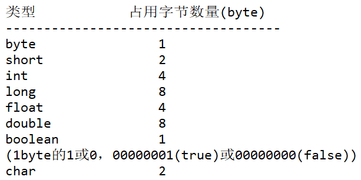
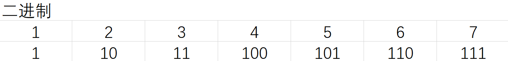
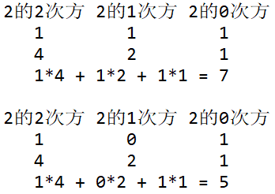

- ## Day06
	- #+BEGIN_QUOTE
	  视频：076-087
	  课程内容：数据类型概述、计算机存储单位、二进制与十进制、取值范围、字符编码、字符char可以容纳一个汉字
	  #+END_QUOTE
- ## 一、数据类型
	- #### 1、数据类型有什么用？
		- 数据类型用来声明变量，程序在运行过程中根据不同的数据类型分配不同大小的空间
		- ```java
		  int i = 10；
		  double d = 1.23;
		  ```
			-
		- i变量和d变量类型不同，空间大小不同
	- #### 2、数据类型在Java语言中包括两种
		- **第一种：基本数据类型**
			- ```java
			  基本数据类型又可以划分为四大类，八小种
			  四大类：整数型，浮点型，布尔型，字符型
			  八小种：byte, short, int, long（占用的字节分别为1、2、4、8）
			  	float, double
			  	boolean：只有两个值 true和false
			  	char：java中规定字符型字面量必须使用单引号括起来，属于文字
			      	 （注：在java语言中“数据”被称为“字面量”）
			  ```
		- **第二种：引用数据类型**
			- 字符串型**String**属于引用数据类型
			- String字符串不属于基本数据类型范畴
			  java中除了基本数据类型之外，剩下的都是引用数据类型
			  引用数据类型后期面向对象的时候才会接触
	- #### 3、八种基本数据类型
		- **八种基本数据类型的区别**
			- 整数型：byte short int long 
			  浮点型：float double 
			  ==占用的空间大小不同==
		- **关于计算机存储单位？**
			- ```java
			  计算机只能识别二进制：1001101100
			  	1byte（字节） = 8bit（比特）
			  	1bit就一个1或0
			  	1 KB = 1024 byte
			  	1 MB = 1024 KB
			  	1 GB = 1024 MB
			  	1 TB = 1024 GB
			  	byte b = 2；在计算机中是这样表示的：00000010
			  	short s = 2；在计算机中是这样表示的：00000000 00000010
			  	int i = 2；在计算机中是这样表示的：00000000 00000000 00000000 00000010
			  ```
			- {:height 233, :width 426}
		- **关于二进制？**
			- {:height 66, :width 473}
			- 十进制转换成二进制
				- 125 转换成二进制
				  除以2，余数逆序输出：1111101
			- 二进制转换成十进制
				- {:height 197, :width 258}
	- #### 4、Byte类型的取值范围
		- byte取值范围是 [-128~127] ，共可以标识256个不同的数字
		  byte类型的最大值是怎么计算出来的？
		  byte是1个字节，8个比特位，所以byte可以存储的最大值是：01111111
		  注意：在计算机当中，一个二进制位最左边的是符号位，当为0时表示正数，当为1时表示负数。
		  所以byte类型最大值是：01111111
		  那么是不是2的7次方-1呢？是
		  是不是：10000000（二进制）-1呢？是
		  byte类型最大值是：2的7次方 - 1
		- 有几个取值范围需要大家记住
			- ```java
			  (1个字节) byte：[-128 ~ 127]
			  (2个字节) short：[-32768 ~ 32767] 可以表示65536个不同的数字
			  (4个字节) int：[-2147483648 ~ 2147483647]
			  (2个字节) char：[0~65535]  可以表示65536个不同的数字
			  short和char实际上容量相同，不过char可以表示更大的数字。
			  因为char表示的是文字，文字没有正负之分，所以char可以表示更大的数字
			  ```
	- #### 5、对于八种基本数据类型来说
		- **字符编码的由来**
			- 其中byte,short,int,long,float,double,boolean
			  这7种类型计算机表示起来比较容易，因为他们都是数字。
			  其中布尔类型只有两个值 true 和 false
			  实际上true和false分别在C++中对应的是1和0，1为true，false为0
			- 对于char类型来说计算机表示起来比较麻烦，因为char对应的是文字
			  每一个国家的文字不一样，文字不能直接通过“自然算法”转换成二进制。这个时候怎么办？
			  **字符编码诞生了**
		- **什么是字符编码？**
			- 字符编码是人为的定义的一套转换表。
			- ==字符编码其实本质上就是一本字典==，该字段中描述了文字与二进制之间的对照关系。
			- 字符编码是人为规定的（是某个计算机协会规定的。）
			- 字符编码涉及到编码和解码两个过程，==**编码和解码的时候必须采用同一套字符编码**==
			  方式，不然就会出现乱码。
		- **关于字符编码的发展过程？**
			- 起初的时候计算机是不支持文字的，只支持科学计算。实际上计算机起初是为了
			  战争而开发的，计算导弹的轨道
			  后来随着计算机的发展，计算机开始支持文字，最先支持的文字是英文，英文
			  对应的字符编码方式是：ASCII码
			- ASCII码采用1byte进行存储，因为英文字母是26个。
			  键盘上所有的键全部算上也超不过256个，1byte可以表示256种不同的情况
			  所以英文本身在计算机方面就占有优势
			- ```java
			  'a' ——(采用ASCII码进行编码)—— 01100001
			  01100001 ——(采用ASCII码进行解码)—— 'a'
			  编码和解码必须采用同一种方式
			  如果编码和解码采用的不是同一个编码方式，就会出现乱码。
			  'a' ---> 97
			  'b' ---> 98
			  'c' ---> 99
			  'A' ---> 65
			  'B' ---> 66
			  '0' ---> 48  注：这个'0'不是数字0，是文字'0'，（带单引号）
			  '1' ---> 49
			  ```
			- 随着计算机语言的发展，后来国际标准组织制定了**ISO-8859-1**编码方式又称为**latin-1**编码方式，向上兼容**ASCII码**。但不支持中文。后来发展到亚洲，才支持中文，日文，韩文....
				- 中文这块的编码方式：GB2312 < GBK < GB18030 （容量的关系）
				- 以上编码方式是简体中文。
				  繁体中文：Big5（台湾使用的是大五码）
				- 在java中，java语言为了支持全球所有的文字，采用了一种字符编码方式叫做**unicode编码**
				  unicode编码统一了全球所有的文字，支持所有文字。
				  具体的实现包括：UTF-8 UTF-16 UTF-32....
			- 需要记住以下编码
				- ```java
				  ASCII（'a'是97， 'A'是65， '0'是48）
				  ISO-8859-1（latin-1）
				  GB2312
				  GBK
				  GB18030
				  Big5
				  unicode（utf8、utf16、utf32）
				  ```
- ## 二、八种基本数据类型详解
	- 字符型 char
	  整数型 byte short int 
	  浮点型 float double
	  布尔型 boolean
	- **CharTest01.java**
		- ```java
		  /*
		    字符型：
		    char
		    1、char占用两个字节
		    2、char的取值范围为：【0 - 65535】
		    3、char采用unicode编码方式
		    4、char类型的字面量用单引号括起来
		    5、char可以存储一个汉字
		  */
		  public class CharTest01
		    public static void main(String[] args){
		        //char可以存储1个汉字吗？	
		        //可以的，汉字占用2个字节，java中的char类型占用2个字节，正好。
		        char c1 = '中';
		        System.out.println(c1);
		        char c2 = 'a';
		        System.out.println(c2);
		        char c3 = '0'; //0在这里是字符，不是数字
		        System.out.println(c3); 
		            
		        错误1: 不兼容的类型: String无法转换为char
		        //char c4 = "a";
		        错误2: 未结束的字符文字
		       （它认为a后面应该是个'，但是没有读取到该字符，所以报错：“未结的字符文字”)
		        //char c5 = 'ab';
		        错误3: 未结束的字符文字
		        //char c6 = '1.08';       
		    }
		    
		  运行步骤：
		  	1、javac *.java 把所有.java文件进行编译，生成字节码文件.class
		  	2、java CharTest01.java 运行CharTest01.java文件
		  结果：
		  	C:\Users\Administrator\Desktop>java CharTest01.java
		  	中
		  	a
		  	0
		  ```
		-
	- **CharTest02.java**
		- ```java
		  //关于java中的转义字符
		  public class CharTest02{
		  	public static void main(String[] args){
		      	//普通的't'字符
		          char c1 = 't';
		          System.out.println(c1);
		        
		  	// 根据之前所学，以下代码应该报错。
		  	// 经过测试以下代码 \t 实际上是一个字符，不属于字符串
		  	// 两个字符合在一起表示一个字符，其中 \t 表示 “制表符tab”
		  	char c2 = '\t'; //相当于键盘上的tab键
		  
		  	System.out.println("abcdef");
		  	System.out.println("abctdef");
		  	// \的出现会将紧挨着的后面的字符进行转义。\碰到t表示tab键。
		  	System.out.println("abc\tdef");
		  		
		  	/*
		  		System.out.println(); 换行
		  		System.out.print(); 不换行
		  	*/
		  	System.out.print("HelloWorld");
		  	System.out.println("123abcdef");
		  
		  	System.out.print("abc");
		  	//char c3 = 'n'; // 普通的n字符
		  	char c3 = '\n'; // 换行符
		  	System.out.print(c3); // System.out.println(c3); 换两行
		  	System.out.println("def"); 
		      }
		  }
		      
		  ```
	-